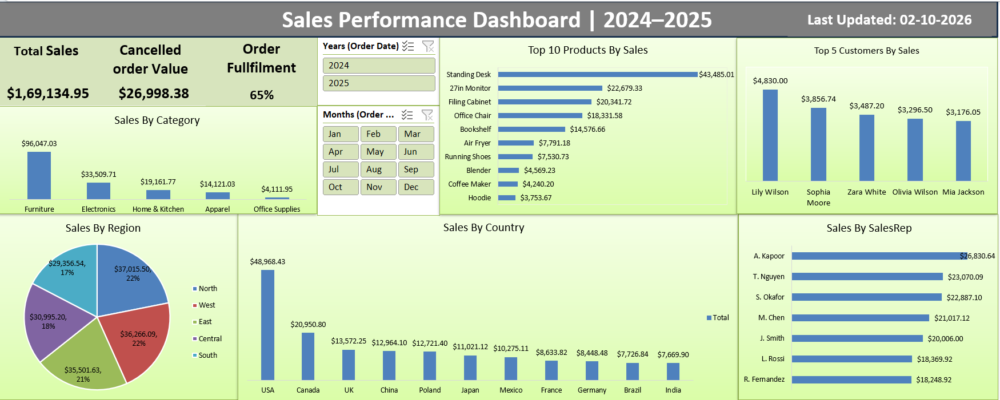

# Sales-performance-dashboard
Excel dashboard project: cleaned messy raw sales data using Power Query and built an interactive sales performance dashboard with PivotTables and slicers.
# Sales Performance Dashboard (Excel + Power Query)

An end-to-end ETL and dashboard project built in Excel: raw, deliberately messy sales
data cleaned via Power Query, modeled with PivotTables, and visualized in an
interactive one-page dashboard.

## Project Overview
- **Source data:** 1,454-row raw sales export with real-world data quality issues
  (inconsistent date formats, mixed currency text, duplicate rows, missing values,
  inconsistent casing, negative quantities)
- **Tools used:** Excel, Power Query (M), PivotTables, PivotCharts, Slicers
- **Goal:** Clean raw data into a reliable source table, then surface key sales
  insights in a single-screen dashboard

## Data Cleaning (Power Query)
- Standardized OrderDate from 6+ inconsistent formats into a single date type
- Fixed inconsistent casing/typos in Region and OrderStatus (e.g. "Esat" → "East",
  "completed"/"COMPLETED" → "Completed")
- Converted UnitPrice from mixed text (`$45.00`, `$ 1,200.00`) into numeric values
- Normalized Discount from mixed decimal/percentage-text formats into a consistent
  decimal
- Corrected negative Quantity values (verified against OrderStatus to rule out
  returns logic before treating them as data entry errors)
- Removed exact duplicate and near-duplicate rows, and fully blank rows
- Handled missing values in Email, Country, SalesRep, and PaymentMethod
  labeled "Unknown"

## Dashboard Features
- **KPIs:** Total Sales (Completed orders), Cancelled Order Value, Order
  Fulfillment Rate
- **Breakdowns:** Sales by Region, Country, Product Category, Top 10 Products,
  Top 5 Customers, Sales by Rep
- **Interactivity:** Year and Month slicers connected across all charts
- All metrics are filtered consistently to Completed orders to ensure KPIs and
  charts reconcile with each other

## Key Decisions & Assumptions
- Revenue calculated as `Quantity × UnitPrice × (1 − Discount)`
- "Total Sales" reflects Completed orders only; Cancelled/Returned value is
  reported separately rather than netted out silently
- No cost/COGS data was available in the source, so Profit was not calculated —
  only Revenue-based metrics are shown, to avoid presenting an unsupported number

## Files
- `raw_sales_data.xlsx` — original raw export
- `Sales Dashboard.xlsx` — cleaned data + Power Query steps + dashboard
- `Sales_Performance_Dashboard 2024-25.png` — screenshot of the final dashboard
 
## Author
Vivek Anand — [LinkedIn link](https://www.linkedin.com/in/vivek-anand-037a32ba/)
